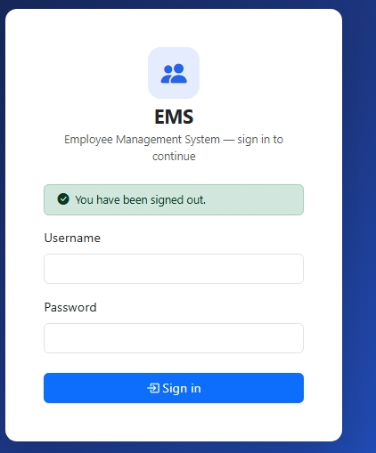
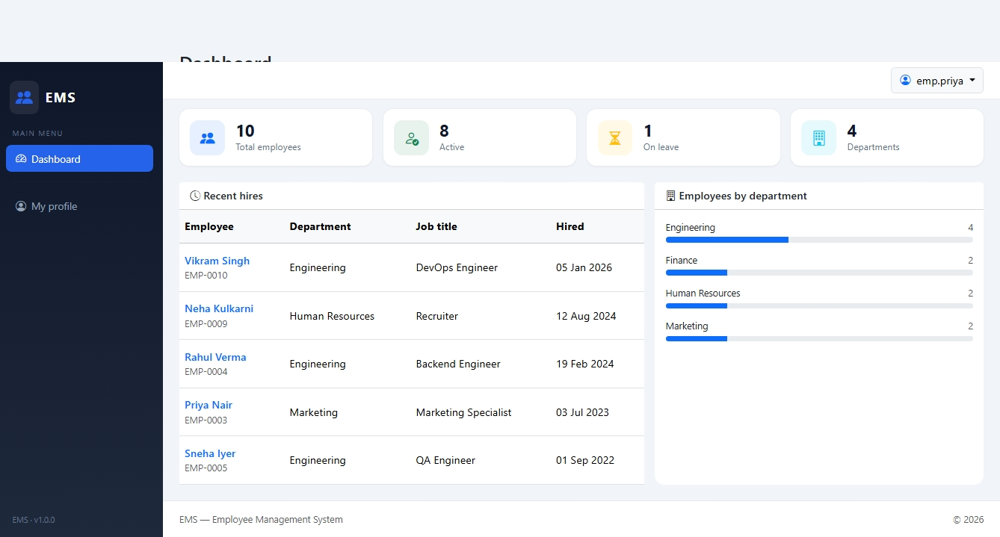
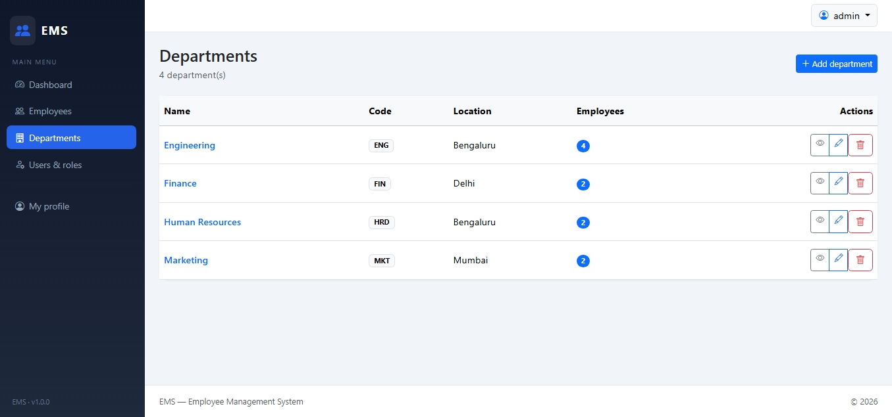
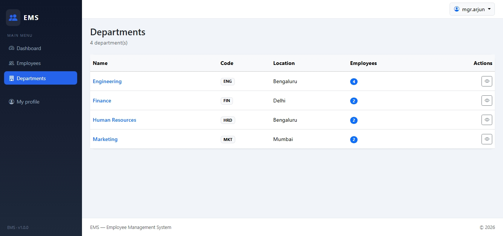
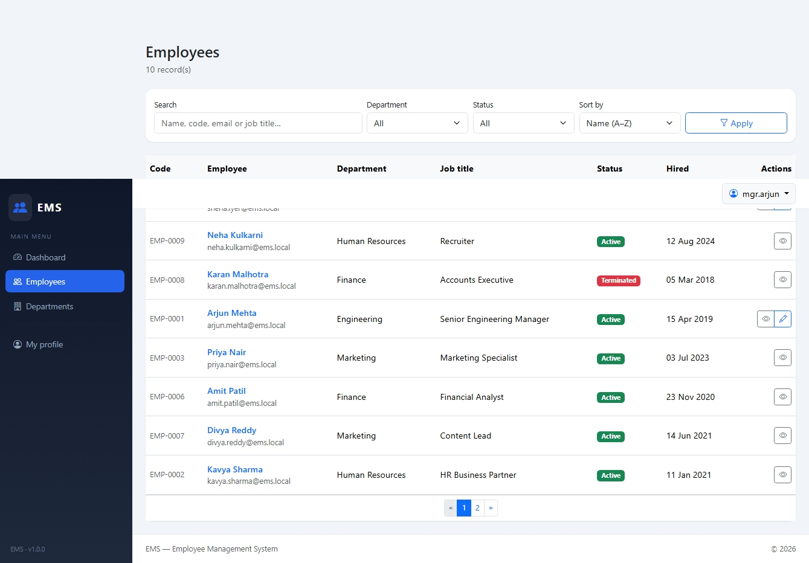

# 👥 Employee Management System — Spring Boot HRMS

<p align="center">
  <strong>A full-stack Employee Management System built with Spring Boot, Thymeleaf, Spring Security, Spring Data JPA and PostgreSQL.</strong>
</p>

<p align="center">
  <a href="https://github.com/imrajeevnayan/employee-management-system">
    
  </a>
  
  
  
  
  
  
  
  
  
  
</p>

<p align="center">
  <a href="https://imrajeevnayan.github.io/employee-management-system/">
    🌐 Live Documentation
  </a>
  &nbsp; • &nbsp;
  <a href="https://github.com/imrajeevnayan/employee-management-system">
    ⭐ GitHub Repository
  </a>
</p>

---

## 📌 About

**Employee Management System** is a full-stack **Spring Boot HRMS (Human Resource Management System)** built with Java 21.

The application demonstrates a real-world employee management workflow with authentication, role-based access control, employee and department management, search, filtering, pagination, validation, administration features, HR analytics, PostgreSQL persistence and Docker deployment.

This project is designed as a practical **Spring Boot project with source code** for developers, students, Java developers, Spring Boot learners and anyone looking for a real-world HRMS project.

### 🎯 Project Goals

- Build a real-world Spring Boot application
- Demonstrate Spring Security authentication and RBAC
- Implement employee and department CRUD
- Use Spring Data JPA with PostgreSQL
- Implement search, filtering, sorting and pagination
- Use Flyway for database migrations
- Containerize the application with Docker
- Write automated unit and integration tests
- Demonstrate clean layered architecture
- Provide a complete employee management system source code example

---

## ✨ Features

### 🔐 Authentication & Security

- Custom Thymeleaf login page
- Spring Security 6
- BCrypt password hashing
- CSRF protection
- Session fixation protection
- Secure logout
- Account enable/disable
- Password change functionality
- Password strength validation
- Current-password verification
- Self-lockout protection
- Custom 403, 404 and 500 error pages

---

### 🛡️ Role-Based Access Control

The system supports four roles:

| Role | Description |
|---|---|
| `ADMIN` | Complete system administration |
| `HR` | Employee and department management |
| `MANAGER` | Employee management within own department |
| `EMPLOYEE` | Personal profile and self-service |

Authorization is implemented at three levels:

```text
URL Authorization
       ↓
Method Authorization
       ↓
Service-Level Authorization
````

This makes the project a practical **Spring Security RBAC example**.

---

### 👥 Employee Management

The employee module supports:

* Create employee
* View employee
* Update employee
* Delete employee
* Automatic employee code generation
* Unique email validation
* Unique employee code validation
* Department assignment
* Employment status
* Job title
* Hire date
* Salary
* Created/updated audit information
* Optimistic locking

Example employee codes:

```text
EMP-0001
EMP-0002
EMP-0003
EMP-0004
```

---

### 🔎 Employee Search & Directory

The employee directory provides server-side:

* Search
* Filtering
* Sorting
* Pagination

Search can be performed across:

```text
Employee Code
Employee Name
Email
Job Title
```

Filtering includes:

```text
Department
Employment Status
```

The implementation uses:

```text
Spring Data JPA
JPA Specifications
Pageable
Sort
```

---

### 🏢 Department Management

Department management includes:

* Create department
* View department
* Edit department
* Delete department
* Unique department name
* Unique department code
* Employee headcount
* Delete protection when employees are assigned

---

### 👤 User Management

Administrators can:

* Create user accounts
* Assign roles
* Enable accounts
* Disable accounts
* Reset passwords
* Link users to employee records
* Manage application access

Self-lockout protection prevents an administrator from accidentally disabling their own account or removing their own administrator access.

---

### 👨‍💼 Manager Department Scoping

Managers can only manage employees belonging to their own department.

Example:

```text
                    MANAGER
                       │
                       ▼
                Own Department?
                  /          \
                YES           NO
                 │             │
                 ▼             ▼
              ALLOW          DENY
                ✅             ❌
```

This authorization rule is implemented in the service layer using fine-grained business checks.

---

### 👤 Employee Self-Service

Employees can:

* View their own profile
* View their employee information
* Change their password
* Access permitted features

Employees cannot modify other employee records.

---

### 📊 HR Dashboard

The dashboard provides:

* Total employee count
* Department statistics
* Employees by department
* Recent hires
* HR management information
* Headcount KPIs

---

# 🧰 Technology Stack

| Layer            | Technology           |
| ---------------- | -------------------- |
| Language         | Java 21              |
| Backend          | Spring Boot 3.3      |
| Web Framework    | Spring MVC           |
| Template Engine  | Thymeleaf 3          |
| Security         | Spring Security 6    |
| ORM              | Hibernate 6          |
| Persistence      | Spring Data JPA      |
| Database         | PostgreSQL 16        |
| Migration        | Flyway               |
| UI               | Bootstrap 5.3        |
| Icons            | Bootstrap Icons      |
| Build Tool       | Maven                |
| Containerization | Docker               |
| Orchestration    | Docker Compose       |
| Testing          | JUnit 5              |
| Mocking          | Mockito              |
| Web Testing      | MockMvc              |
| Security Testing | spring-security-test |
| Test Database    | H2                   |

---

# 🏗️ Architecture

The application follows a layered architecture:

```text
                         Browser
                            │
                            ▼
                 ┌────────────────────┐
                 │     Thymeleaf      │
                 │    Server Views    │
                 └─────────┬──────────┘
                           │
                           ▼
                 ┌────────────────────┐
                 │    Controllers     │
                 │    Spring MVC      │
                 └─────────┬──────────┘
                           │
                           ▼
                 ┌────────────────────┐
                 │     Services       │
                 │ Business Logic/RBAC│
                 └─────────┬──────────┘
                           │
                           ▼
                 ┌────────────────────┐
                 │   Repositories     │
                 │   Spring Data JPA  │
                 └─────────┬──────────┘
                           │
                           ▼
                 ┌────────────────────┐
                 │    PostgreSQL      │
                 └────────────────────┘
```

---

# 📁 Project Structure

```text
employee-management-system/
│
├── src/
│   ├── main/
│   │   ├── java/
│   │   │   └── com/ems/
│   │   │       │
│   │   │       ├── config/
│   │   │       │   ├── SecurityConfig
│   │   │       │   ├── AuditingConfig
│   │   │       │   └── DataSeeder
│   │   │       │
│   │   │       ├── domain/
│   │   │       │   ├── Employee
│   │   │       │   ├── Department
│   │   │       │   ├── User
│   │   │       │   ├── Role
│   │   │       │   └── Enums
│   │   │       │
│   │   │       ├── dto/
│   │   │       │   ├── Employee DTOs
│   │   │       │   ├── Department DTOs
│   │   │       │   └── Password Policy
│   │   │       │
│   │   │       ├── exception/
│   │   │       │   ├── Domain Exceptions
│   │   │       │   └── Global Exception Handler
│   │   │       │
│   │   │       ├── repository/
│   │   │       │   ├── EmployeeRepository
│   │   │       │   ├── DepartmentRepository
│   │   │       │   ├── UserRepository
│   │   │       │   └── Specifications
│   │   │       │
│   │   │       ├── service/
│   │   │       │   ├── EmployeeService
│   │   │       │   ├── DepartmentService
│   │   │       │   ├── UserService
│   │   │       │   └── DashboardService
│   │   │       │
│   │   │       └── web/
│   │   │           ├── LoginController
│   │   │           ├── DashboardController
│   │   │           ├── EmployeeController
│   │   │           ├── DepartmentController
│   │   │           ├── UserController
│   │   │           └── ProfileController
│   │   │
│   │   └── resources/
│   │       │
│   │       ├── application.yml
│   │       │
│   │       ├── db/
│   │       │   └── migration/
│   │       │       └── V1__init.sql
│   │       │
│   │       ├── static/
│   │       │   └── css/
│   │       │
│   │       └── templates/
│   │           ├── dashboard/
│   │           ├── departments/
│   │           ├── employees/
│   │           ├── error/
│   │           ├── fragments/
│   │           ├── profile/
│   │           ├── users/
│   │           └── login.html
│   │
│   └── test/
│       └── java/
│
├── docs/
│   ├── index.html
│   ├── robots.txt
│   └── sitemap.xml
│
├── Dockerfile
├── docker-compose.yml
├── pom.xml
└── README.md
```

---

# ⚡ Quick Start

## 🐳 Run with Docker Compose

### 1. Clone the repository

```bash
git clone https://github.com/imrajeevnayan/employee-management-system.git
```

### 2. Enter the project

```bash
cd employee-management-system
```

### 3. Start the application

```bash
docker compose up --build
```

### 4. Open the application

```text
http://localhost:8080
```

That's it! 🚀

Docker Compose starts:

* Spring Boot application
* PostgreSQL 16
* Flyway migrations
* Database schema
* Demo data
* Application health checks

---

# 🐳 Docker Services

| Service |   Port | Description             |
| ------- | -----: | ----------------------- |
| `app`   | `8080` | Spring Boot application |
| `db`    | `5432` | PostgreSQL database     |

PostgreSQL is exposed on localhost.

Database data is stored in the Docker named volume:

```text
ems_pgdata
```

---

# 🔑 Demo Login Credentials

The application contains seeded accounts for testing each role.

| Username    | Password       | Role     | Demonstrates                 |
| ----------- | -------------- | -------- | ---------------------------- |
| `admin`     | `Admin@123`    | ADMIN    | Full administration          |
| `hr.kavya`  | `Hr@12345`     | HR       | HR management                |
| `mgr.arjun` | `Manager@123`  | MANAGER  | Department-scoped management |
| `emp.priya` | `Employee@123` | EMPLOYEE | Employee self-service        |

### Demo Employee Links

| Username    | Employee     | Department      |
| ----------- | ------------ | --------------- |
| `hr.kavya`  | Kavya Sharma | Human Resources |
| `mgr.arjun` | Arjun Mehta  | Engineering     |
| `emp.priya` | Priya Nair   | Marketing       |

> ⚠️ These credentials are for local/demo use only. Change all passwords before using the application in a real environment.

---

# 🛡️ RBAC Permission Matrix

| Capability              | ADMIN |  HR |     MANAGER    |  EMPLOYEE  |
| ----------------------- | :---: | :-: | :------------: | :--------: |
| Dashboard               |   ✅   |  ✅  |        ✅       |      ✅     |
| View employee directory |   ✅   |  ✅  |        ✅       | Own record |
| View employee details   |   ✅   |  ✅  |        ✅       | Own record |
| Create employees        |   ✅   |  ✅  |        ❌       |      ❌     |
| Edit employees          |   ✅   |  ✅  | Own department |      ❌     |
| Delete employees        |   ✅   |  ❌  |        ❌       |      ❌     |
| View departments        |   ✅   |  ✅  |        ✅       |      ❌     |
| Create departments      |   ✅   |  ✅  |        ❌       |      ❌     |
| Edit departments        |   ✅   |  ✅  |        ❌       |      ❌     |
| Delete departments      |   ✅   |  ✅  |        ❌       |      ❌     |
| Manage users            |   ✅   |  ❌  |        ❌       |      ❌     |
| Manage roles            |   ✅   |  ❌  |        ❌       |      ❌     |
| Reset passwords         |   ✅   |  ❌  |        ❌       |      ❌     |
| Own profile             |   ✅   |  ✅  |        ✅       |      ✅     |
| Change own password     |   ✅   |  ✅  |        ✅       |      ✅     |

---

# 🔒 How RBAC Works

Authorization is implemented in three layers.

## 1. URL Authorization

Spring Security protects application endpoints using request matchers.

Example:

```java
.requestMatchers("/users/**").hasRole("ADMIN")
```

## 2. Method Security

Sensitive operations can use:

```java
@PreAuthorize("hasRole('ADMIN')")
```

## 3. Service-Level Authorization

Business rules are enforced in the service layer.

Example:

```text
                    MANAGER
                       │
                       ▼
                Own Department?
                  /          \
                YES           NO
                 │             │
                 ▼             ▼
              ALLOW          DENY
                ✅             ❌
```

This provides an additional layer of protection even if controller routes are changed.

---

# 🗄️ Database

The project uses:

```text
PostgreSQL 16
      +
Spring Data JPA
      +
Hibernate 6
      +
Flyway
```

### Main database entities

```text
Department
    │
    └── Employee
           │
           └── User

User
    │
    └── Role
```

The main tables include:

```text
employees
departments
users
roles
user_roles
```

---

# 🔄 Flyway Database Migrations

Database migrations are stored under:

```text
src/main/resources/db/migration/
```

Example:

```text
V1__init.sql
```

Flyway manages the database schema while Hibernate validates it.

```yaml
spring:
  jpa:
    hibernate:
      ddl-auto: validate
```

This prevents Hibernate from silently changing the production database schema.

---

# 🧪 Testing

Run the complete test suite:

```bash
mvn verify
```

The project includes **27 automated tests** covering areas such as:

* Authentication
* Login success/failure
* RBAC permissions
* Employee authorization
* Manager department restrictions
* Employee self-access
* Thymeleaf page rendering
* Employee service rules
* Repository operations
* Database schema validation
* Application context

Testing stack:

```text
JUnit 5
Mockito
MockMvc
spring-security-test
H2
```

---

# 💻 Run Without Docker

If PostgreSQL is already installed locally:

```bash
mvn spring-boot:run
```

Or start only PostgreSQL with Docker:

```bash
docker compose up -d db
```

Then run:

```bash
mvn spring-boot:run
```

Open:

```text
http://localhost:8080
```

---

# ⚙️ Configuration

The following environment variables can be configured:

| Variable                     | Default                                |
| ---------------------------- | -------------------------------------- |
| `SPRING_DATASOURCE_URL`      | `jdbc:postgresql://localhost:5432/ems` |
| `SPRING_DATASOURCE_USERNAME` | `ems`                                  |
| `SPRING_DATASOURCE_PASSWORD` | `ems`                                  |
| `EMS_ADMIN_PASSWORD`         | `Admin@123`                            |

### Example

```bash
EMS_ADMIN_PASSWORD=MyStrongPassword123! docker compose up --build
```

For production environments, use environment variables or a secrets manager rather than storing credentials in source code.

---

# 🔐 Security Practices

The project demonstrates:

* BCrypt password hashing
* CSRF protection
* Secure logout
* Role-based authorization
* URL authorization
* Method authorization
* Service-level authorization
* Password validation
* Account enable/disable
* Self-lockout protection
* Optimistic locking
* Database constraints
* Bean Validation
* Safe error pages
* Server-side authorization checks
* `open-in-view: false`

---

# 🏥 Health Check

The application includes Spring Boot Actuator health monitoring.

Health endpoint:

```text
http://localhost:8080/actuator/health
```

Docker uses the health endpoint to verify that the application is running correctly.

---

# 🧹 Reset Database

Stop the application:

```bash
docker compose down
```

To completely remove the PostgreSQL database volume:

```bash
docker compose down -v
```

> ⚠️ This permanently deletes local database data.

Start the application again:

```bash
docker compose up --build
```

Demo data will be recreated.

---

# 📸 Screenshots

Here are the screenshots of the Employee Management System demonstrating the different roles and features:

### 🔐 Login Page


---

### 📊 Dashboards by Role

#### 👑 Admin Dashboard


#### 👥 HR Dashboard


#### 👔 Manager Dashboard


#### 👤 Employee Dashboard


---

### 🏢 Department Management
#### Admin View


#### Manager View


---

### 👥 Employee Directory
#### Manager View (scoped to own department)



---

# 🌐 GitHub Pages Documentation

This repository includes a dedicated project website.

### 🌐 Live Website

[https://imrajeevnayan.github.io/employee-management-system/](https://imrajeevnayan.github.io/employee-management-system/)

### 📂 Documentation Files

```text
docs/
├── index.html
├── robots.txt
└── sitemap.xml
```

The documentation website includes:

* Project overview
* Feature documentation
* Technology stack
* RBAC explanation
* Quick start instructions
* FAQ
* SEO metadata
* Open Graph metadata
* Structured data
* Sitemap
* Robots configuration

---

# 🎓 What You Can Learn

## Spring Boot

* Layered architecture
* Controllers
* Services
* Repositories
* DTOs
* Bean Validation
* Exception handling
* Configuration
* Dependency injection

## Spring Security

* Authentication
* Form login
* Password encoding
* RBAC
* `@PreAuthorize`
* CSRF
* Authorization rules
* Session management

## Spring Data JPA

* Entity relationships
* Repository queries
* Pagination
* Sorting
* Specifications
* Auditing
* Optimistic locking

## Thymeleaf

* Server-side rendering
* HTML forms
* Validation messages
* Layout fragments
* Spring Security integration
* Role-aware navigation

## PostgreSQL

* Relational database design
* Foreign keys
* Unique constraints
* Indexes
* Database migrations

## Docker

* Multi-stage builds
* Docker Compose
* PostgreSQL containers
* Health checks
* Persistent volumes

---

# 💼 Resume Project

### Resume Description

> **Employee Management System — Spring Boot HRMS**
>
> Developed a full-stack employee management system using Java 21, Spring Boot, Spring Security, Thymeleaf, Spring Data JPA and PostgreSQL. Implemented multi-role RBAC, employee and department CRUD, server-side search and pagination, Flyway database migrations, Docker Compose deployment and automated security/service tests.

### Technologies

```text
Java 21
Spring Boot
Spring Security
Spring Data JPA
Hibernate
Thymeleaf
PostgreSQL
Flyway
Docker
Docker Compose
JUnit 5
Mockito
MockMvc
Maven
```

---

# 🎯 Interview Topics Demonstrated

This project can help demonstrate knowledge of:

* Spring Boot architecture
* Dependency injection
* MVC architecture
* Controllers
* DTO pattern
* Service layer
* Repository pattern
* Spring Security
* Authentication vs authorization
* Role-Based Access Control
* `@PreAuthorize`
* Password hashing
* CSRF
* JPA relationships
* Hibernate
* Pagination
* Sorting
* JPA Specifications
* Database constraints
* Flyway migrations
* Optimistic locking
* JPA auditing
* Docker
* Docker Compose
* Unit testing
* Integration testing
* MockMvc

---

# 🔍 SEO Keywords

This project is relevant to developers searching for:

```text
employee management system
employee management system spring boot
employee management system in java
employee management system source code
employee management system github
spring boot employee management system
spring boot employee management system github
spring boot HRMS
HRMS spring boot project
human resource management system spring boot
spring boot project with source code
spring boot CRUD project
spring boot CRUD application
spring security RBAC example
spring security role based access control
spring data JPA pagination example
spring boot thymeleaf project
spring boot PostgreSQL project
spring boot docker compose
spring boot flyway example
Java employee management project
Java HRMS project
employee management system Java
employee management system PostgreSQL
employee management system Docker
```

---

# 🤝 Contributing

Contributions and improvements are welcome.

### 1. Fork the repository

### 2. Create a feature branch

```bash
git checkout -b feature/new-feature
```

### 3. Make your changes

### 4. Run tests

```bash
mvn verify
```

### 5. Commit your changes

```bash
git add .
git commit -m "Add new feature"
```

### 6. Push your branch

```bash
git push origin feature/new-feature
```

### 7. Open a Pull Request

---

# ⭐ Support

If this project helps you learn:

* Java
* Spring Boot
* Spring Security
* Spring Data JPA
* PostgreSQL
* Docker
* Thymeleaf

please consider giving the repository a ⭐.

<p align="center">
  <a href="https://github.com/imrajeevnayan/employee-management-system">
    ⭐ Star this repository
  </a>
</p>

---
# 🔗 Project Links
| Resource            | Link                                                                                                                                                               |
| ------------------- | ------------------------------------------------------------------------------------------------------------------------------------------------------------------ |
| ⭐ GitHub Repository | [https://github.com/imrajeevnayan/employee-management-system](https://github.com/imrajeevnayan/employee-management-system)                                         |
| 🌐 Project Website  | [https://imrajeevnayan.github.io/employee-management-system/](https://imrajeevnayan.github.io/employee-management-system/)                                         |
| 📖 README           | [https://github.com/imrajeevnayan/employee-management-system/blob/main/README.md](https://github.com/imrajeevnayan/employee-management-system/blob/main/README.md) |
| 🐛 Issues           | [https://github.com/imrajeevnayan/employee-management-system/issues](https://github.com/imrajeevnayan/employee-management-system/issues)                           |

---

# 📄 License

If you want to distribute this project as open source, add an appropriate license to the repository.

For example:

```text
MIT License
```
Create a `LICENSE` file in the repository containing the full license text.
---
# ❤️ Built With Java & Spring Boot
<p align="center">
<strong>👥 Employee Management System</strong>
<br><br>
Spring Boot • Spring Security • Thymeleaf • Spring Data JPA • Hibernate • PostgreSQL • Flyway • Docker
<br><br>
<a href="https://github.com/imrajeevnayan/employee-management-system">
⭐ View Source Code on GitHub
</a>
  •  
<a href="https://imrajeevnayan.github.io/employee-management-system/">
🌐 Visit Project Website
</a>

</p>

---

<p align="center">
  Made with ❤️ using Java and Spring Boot.
</p>
```
